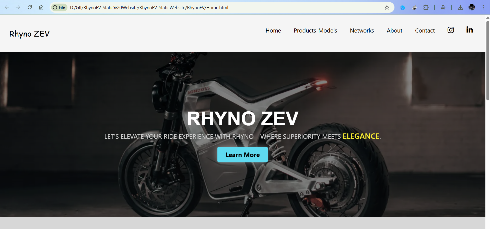
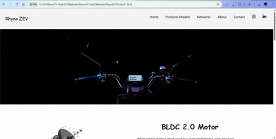
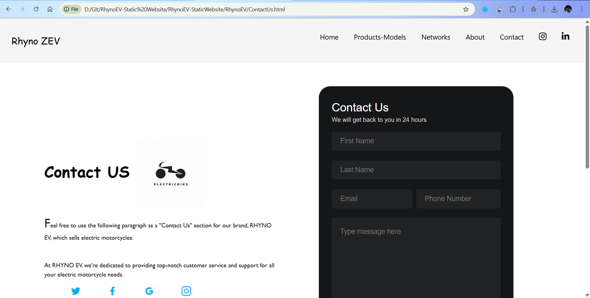

<div align="center">

# RhynoEV — Electric Bikes Website  

[](https://developer.mozilla.org/en-US/docs/Web/HTML)
[](https://developer.mozilla.org/en-US/docs/Web/CSS)
[](https://developer.mozilla.org/en-US/docs/Web/JavaScript)
[](https://opensource.org/licenses/MIT)

---

### 🏍️ Overview  
**RhynoEV** is a modern and responsive website designed to showcase **electric bikes** and promote the future of eco-friendly transportation.  
The project emphasizes **clean UI design**, **interactive pages**, and **brand-focused presentation** for the electric vehicle industry.  

Built with **HTML**, **CSS**, and **JavaScript**, this website contains dedicated pages for products, company introduction, and contact details.

---



---

## 🌐 Website Structure  
</div>

| Section | Description |
|----------|-------------|
| 🏠 **Home** | Landing page introducing Rhyno Electric Bikes with brand logo and navigation bar. |
| 🧍 **About Us** | Highlights the vision, mission, and team behind RhynoEV. |
| ⚙️ **Products** | Displays electric bike models (SE Lite, SE01, SE01 Max) with specifications and images. |
| 📞 **Contact Us** | Contact form and company network details. |
| 🌍 **Network** | Information about the dealership and service network. |

<div align="center">

---

## 🧩 Tech Stack  

| Technology | Purpose |
|-------------|----------|
| **HTML5** | Page structure and layout |
| **CSS3** | Styling and responsive design |
| **JavaScript (ES6)** | Dynamic content and interactivity |
| **Visual Studio Code** | Development environment |

---

## 📁 Project Files Overview  

| File / Folder | Description |
|----------------|-------------|
| `Home.html` | Main landing page |
| `AboutUs.html`, `AboutUs.js` | About page content and script |
| `Products.html`, `Products.js` | Electric bike listing and details |
| `ContactUs.html` | Contact form page |
| `Network.html` | Rhyno dealership and service points |
| `Logo Nav.png` | Brand logo |
| `Rhyno.png` | Website banner logo |
| `Face1–Face4.jpg` | Team member images |
| `SE01.png`, `SE01 Max.png`, `SE Lite.png` | Electric bike models |
| `screenshot...` | Product component previews |

---

## 🖼️ Sample Webpage Previews  

### 🧍 About Us  


### ⚙️ Products Page  


### 📞 Contact Us  


> _Replace the image paths above with actual links after uploading screenshots to your repository_

---

## 🚴 Featured Bikes  

| Model | Description |
|--------|-------------|
| **Rhyno SE Lite** | Entry-level EV bike with balanced performance. |
| **Rhyno SE01** | Mid-range model with enhanced power and battery life. |
| **Rhyno SE01 Max** | Premium electric bike offering top performance and advanced design. |

---

## 🧠 Key Features  
⚡ Responsive web design for desktop and mobile  
🧍 Interactive About Us and Contact sections  
💡 Modern design showcasing eco-friendly innovation  
📸 Product images and detailed specifications  
🔗 Navigation bar for seamless user experience  

---

## 👨‍💻 Developer  

**Abhishek Pandey**  
_B.Tech CSE (AI), Amrita School of Engineering, Coimbatore_  

> A web-based project showcasing the integration of design and clean structure in front-end development.

---

## 📜 License  
This project is licensed under the [MIT License](LICENSE).

---

## 💬 How to Run  

```bash
git clone https://github.com/AoD-X-abhi/RhynoEV-StaticWebsite.git
